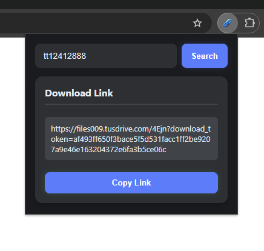

# FilmXY Link Extractor

A Chrome extension that simplifies the process of extracting download links from FilmXY. Search by IMDb ID and manage download links efficiently with a clean, dark-themed interface.

## Features

- 🔍 Quick IMDb code search
- 🔗 Automatic link extraction
- 📋 Easy copy functionality
- 🌙 Dark mode interface
- 💾 Last search memory
- 🎯 Simple and intuitive UI

## Installation

### From Chrome Web Store
1. Visit [FilmXY Link Extractor](https://chrome.google.com/webstore/detail/your-extension-id) on the Chrome Web Store
2. Click "Add to Chrome"
3. Follow the prompts to install

### Manual Installation (Developer Mode)
1. Download or clone this repository
2. Open Chrome and go to `chrome://extensions/`
3. Enable "Developer mode" in the top right
4. Click "Load unpacked"
5. Select the extension directory

## Usage

1. Click the extension icon in your Chrome toolbar
2. Enter an IMDb code (e.g., tt1234567)
3. Click "Search" to open the FilmXY page
4. The extension will automatically extract download links
5. Click on any link to copy it to clipboard
6. Use "Copy Link" to copy the extracted link

## Development

### Prerequisites
- Google Chrome
- Basic knowledge of HTML, CSS, and JavaScript

### Project Structure 

filmxy-link-extractor/
├── manifest.json # Extension configuration
├── popup.html # Extension popup interface
├── popup.js # Popup functionality
├── background.js # Background service worker
├── icons/ # Extension icons
│   ├── icon16.png
│   ├── icon32.png
│   ├── icon48.png
│   └── icon128.png
├── screenshots/ # Extension screenshots
│   └── screenshot.png
└── README.md # Documentation

### Features in Detail

#### 1. IMDb Code Search
- Quick search using IMDb ID (e.g., tt1234567)
- Validates input format
- Remembers last searched code

#### 2. Link Extraction
- Automatically extracts download links
- Handles different quality options
- Clean presentation of extracted links

#### 3. User Interface
- Dark theme for comfortable viewing
- Responsive design
- Clear status messages
- Loading indicators

## Technical Details

### Permissions Used
- `activeTab`: For interacting with the current tab
- `scripting`: For executing content scripts
- `storage`: For saving last used IMDb code
- `webRequest`: For intercepting network requests
- `tabs`: For managing browser tabs

### Host Permissions
- `*://exe.io/*`: For extracting download links
- `*://www.filmxy.vip/*`: For accessing FilmXY website

## Privacy & Security

This extension:
- Does not collect any personal data
- Does not track user behavior
- Only accesses specified domains
- Stores minimal data locally (last used IMDb code)
- No external analytics or tracking

## Support

For issues and feature requests:
1. Open an issue on GitHub
2. Provide detailed information about the problem
3. Include steps to reproduce if applicable

## Contributing

Contributions are welcome! Please feel free to submit a Pull Request.

1. Fork the repository
2. Create your feature branch (`git checkout -b feature/AmazingFeature`)
3. Commit your changes (`git commit -m 'Add some AmazingFeature'`)
4. Push to the branch (`git push origin feature/AmazingFeature`)
5. Open a Pull Request

## License

This project is licensed under the WTFPL - Do What The Fuck You Want To Public License.
See [LICENSE](LICENSE) file for details.

## Author

**sh13y**
- Website: [sh13y.github.io](https://sh13y.github.io)
- GitHub: [@sh13y](https://github.com/sh13y)

---

Made with ❤️ by sh13y
